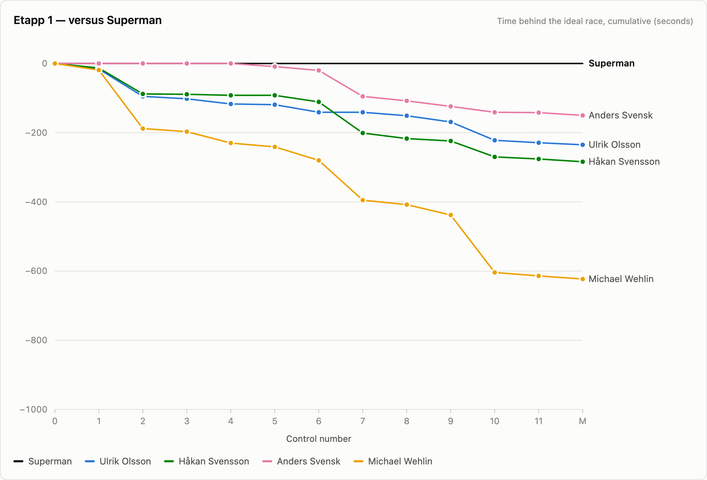
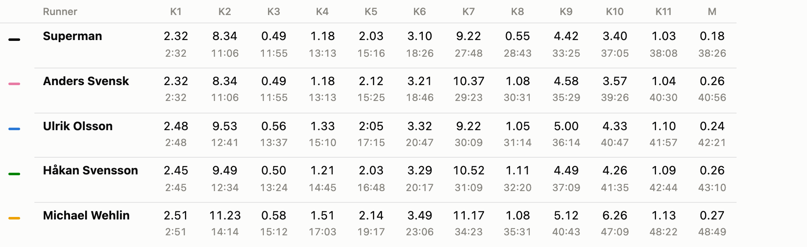
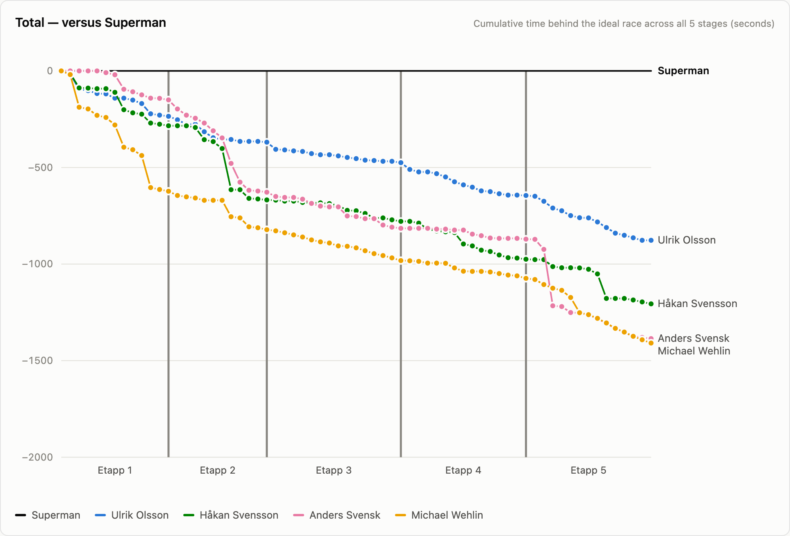
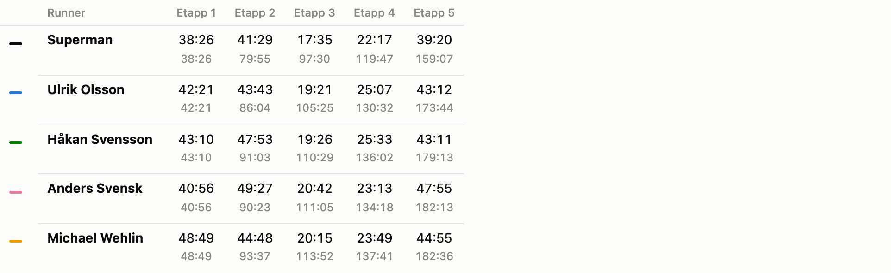

# Superman — Orienteering split analysis

A small application for analysing **split times** from multi‑stage orienteering
competitions. It builds a virtual runner called **Superman**, the fastest split
on every leg combined into one ideal race and shows how far each real runner
falls behind that ideal, per stage and across the whole competition. The data for this project is manually written and comes from the H60 class at O-Ringen 2026 in Gothenburg.

**Live:** https://timol085.github.io/Superman/

---

## What is "Superman"?

In orienteering you run a course with a series of controls. The time between two
controls is a **leg time** (split). Superman takes the **fastest split on each
leg** (often from different runners) and stitches them into a single perfect
race that nobody actually ran.

Each runner's line on the graph shows their **cumulative time behind Superman**:
it starts at 0 and drops as they lose time. Superman is the flat line at the top.

> Example — three runners, three legs:
>
> |                                 | Leg 1    | Leg 2    | Leg 3    |
> | ------------------------------- | -------- | -------- | -------- |
> | Ulrik                           | 2:37     | 3:01     | 5:58     |
> | Anders                          | 2:27     | 3:30     | 5:58     |
> | Håkan                           | 2:50     | 3:05     | 5:45     |
> | **Superman** (fastest each leg) | **2:27** | **3:01** | **5:45** |

---

## Screenshots

**Per‑stage graph** — cumulative time behind Superman, control by control
(`M` = finish (Mål)):



**Per‑stage table** — each runner's leg time (top row) and running elapsed total
(grey row beneath), sorted fastest first:



**Combined graph** — all five stages in one continuous line, with a divider
between stages:



**Combined standings** — total time per stage (top) and the running competition
total beneath, so the value under _Etapp 5_ is the overall time:



---

## Features

- **Per‑stage view** — graph + table for each of the five stages (tabs
  _Etapp 1–5_).
- **Combined view** (_Total_) — all stages concatenated into one graph and an
  overall standings table.
- **Manual or automatic Superman** — give Superman's fastest field splits per
  leg, or leave a leg blank to auto‑use the fastest of the loaded runners.
- **Extra runners** — add anyone beyond the core four to a single stage; they
  appear in that stage only and never in the Combined summary.
- **Hover tooltip** — a crosshair snaps to the nearest control and lists every
  runner's time behind Superman there.
- **Light / dark** toggle (defaults to light).
- **No backend, no build step** — plain HTML, CSS and JavaScript. Data lives in
  JSON files you edit by hand.

---

## Data format

Results live in `data/stage1.json` … `data/stage5.json`. Edit a file and click
**Reload data files** (or refresh) to see the change.

```jsonc
{
  "controls": 3, // optional — inferred from the arrays if omitted
  "superman": ["2.27", "3.01", "5.45"], // optional — omit to auto-use the fastest runner
  "runners": {
    "Ulrik Olsson": ["2.37", "3.01", "5.58"],
    "Håkan Svensson": ["2.50", "3.05", "5.45"],
    "Anders Svensk": ["2.27", "3.30", "5.58"],
    "Michael Wehlin": ["2.41", "3.12", "5.50"],

    "Guest Runner": ["2.44", "3.20", "6.02"], // extra — this stage only
  },
}
```

- Times are strings in **`m.ss`** (or `m:ss`). Write `"3.10"`, not `3.1`, so the
  trailing zero is kept. An empty string `""` marks a missed control.
- Runner names are matched loosely (first name is enough), or you can give a
  plain array of split‑lists in runner order.
- Any runner **beyond the core four** shows only in that stage — never in
  Combined.

---

## Running it locally

Because browsers block a page opened directly from disk (`file://`) from reading
sibling files, you need to serve the folder over HTTP:

```bash
# from the project folder
python3 -m http.server 8000
# then open http://localhost:8000
```

On macOS you can also just double‑click **`serve.command`**, which starts the
server and opens the browser for you.

---

## Project structure

```
index.html          markup (+ a tiny inline theme script)
css/styles.css      all styling
js/app.js           all logic (parsing, model, chart, tables, theme, loading)
data/
  stage1.json … stage5.json
serve.command       double-click launcher (macOS)
screenshots/        images used in this README
```

---

## Deploying (GitHub Pages)

The app is static, so GitHub Pages serves it as‑is:

1. **Settings → Pages → Build and deployment**
2. Source **Deploy from a branch**, branch **`main`**, folder **`/ (root)`**,
   **Save**.
3. The site publishes at `https://<user>.github.io/<repo>/`.

To update results later, edit the relevant `data/stageN.json`, then:

```bash
git add -A && git commit -m "update results" && git push
```

Pages redeploys automatically, same link.
